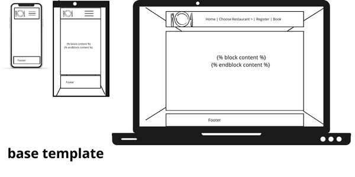
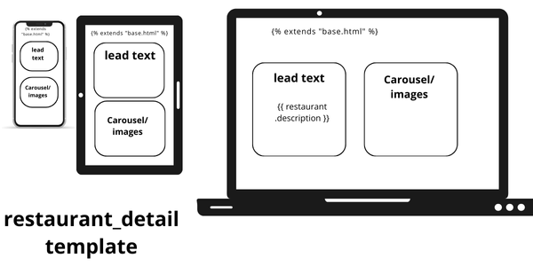
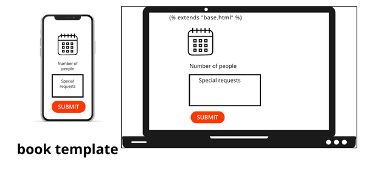

# kode-restaurant
[View the Live Project here](https://kode-restaurant-5f9020dc3f3d.herokuapp.com/)

# Table of Content
- [User Expeience](#user-experience)
    - [Project Overview](#project-overview)
    - [Project Goals](#project-goals)
    - [User Stories](#user-stories)
    - [Design Choices](#design-choices)
    - [Wireframes](#wireframes)
- [Data Model](#data-model)    
- [Features](#features)
- [Technologies Used](#technologies-used)
- [Code](#code)
- [Testing](#testing)
    - [Bugs](#bugs)
    - [Unresolved Bugs](#unresolved-bugs)
    - [Tesing User Stories](#testing-user-stories)
    - [Manual Testing](#manual-testing)
    - [Automated Testing](#automated-testing)
    - [Accessibility](#accessibility)
- [Deployment](#deployment)
- [Maintenance & Updates](#maintenance--updates)
- [Credits](#credits)

## User Experience

### Project Overview

Kode Restaurant is a fictitious client – a growing restaurant company that currently operates one location and plans to open a second in the near future. The business is performing well and has gained significant popularity, particularly at weekends. However, customers have reported difficulties in booking tables, which has resulted in long queues and frustration.

The restaurant has seating for around 80 guests. To balance reservations with walk-in availability, the management decided that only 50 seats should be available for online booking, while the remaining seats are reserved for customers who arrive without a booking.

### Project Goals

The restaurant aims to improve customer experience and streamline operations by implementing:

1. An online booking system integrated into their website.

2. A customer authentication system, allowing users to register, log in, and log out securely.

3. An administrative interface for staff to manage bookings, monitor availability, and prepare for the restaurant’s expansion.

**Expected Outcomes:**

1. Customers will be able to reserve tables in advance, reducing queues and improving satisfaction.

2. Staff will have better control over seating arrangements and capacity.

3. The restaurant will be prepared to scale its booking system to multiple locations as the business grows.

### User Stories

**Customers User Stories:**

1. Register and Log In: As a customer, I want to register, log in, and log out securely, so that I can manage my bookings.

2. Book a table: As a customer, I want to book a table by selecting a date, time slot, and number of people (max 6), so that I can reserve a place in advance.

3. Booking Confirmation: As a customer, I want to see a booking confirmation, so that I know my reservation is secured.

4. Prevent Duplicate Bookings: As a customer, I should not be able to book more than once in the same time slot, so that the system is fair.

5. View Bookings(Past and Future): As a customer, I want to view my past and future bookings, so that I can keep track of my reservations.

6. Edit a Future Booking: As a customer, I want to edit my booking to change the number of people, so that I can update my plans.

7. Delete a Booking: As a customer, I want to cancel my booking, so that I free up the table if I don’t need it.

**Admin/Staff User Stories:**

1. Admin Login: As an admin, I want to see all bookings for a specific date and time slot, so that I can prepare for service.

2. Manage Bookings: As an admin, I want to create, edit, and delete bookings, so that I can handle phone reservations and customer requests.

3. Manage Restaurant Capacity: As an admin, I want to set the number of seats available for online booking, so that I can balance between online reservations and walk-ins.

4. Add/Manage Restaurants (Future): As an admin, I want to add new restaurant locations, so that the business can expand without changing the system.

The project's Kanban Board can be viewd [here](https://github.com/users/dagmara-szproch/projects/11)

### Design Choices

#### Fonts

#### Icons

#### Images

### Wireframes

  

  

  

## Data Model

The aplication uses 2 main models: Restaurant and Booking. 
- The Restaurant model represents a restauration location and stores all key bussines information. **Relationship:** One restaurant can have many bookings.
- The Booking model represents a customer's reservation. Bookings are only available to register users. **Constraints:** User cannot double book the same restaurant, date, and time slot.

<h3>Entity Relationship Diagram</h3>

  

## Features

## Technologies Used

## Code

- [Django models/Unique constraint](https://docs.djangoproject.com/en/5.2/ref/models/constraints/#uniqueconstraint)
- [Django widgets](https://docs.djangoproject.com/en/5.1/topics/forms/modelforms/#overriding-the-default-fields)
- [Django aggregate()](https://docs.djangoproject.com/en/5.2/ref/models/expressions/#aggregate-expressions)
- [Django clean()](https://docs.djangoproject.com/en/5.2/ref/forms/validation/#using-validation-in-practice)
- [Flatpickr calendar](https://flatpickr.js.org/examples/)

## Testing

### Bugs

  **Resolved bugs** found during automated testing:

1. **`booking_date` validation:** Previously, the booking form relied solely on Flatpickr fronted restrictions to prevent selecting today's date, past dates or more than 180 days in advance. users could bypass these rules by disabling JavaScript in their browser, potentially creating invalid bookings. Added server-side validation in `BookingForm` to ensure bookings are only allowed from tomorrow up to 180 days in advance, regardless of fronted controls.
2. **`number_of_people` validation:** Previously, users could bypass the front-end dropdown and submit values greater than 6, which caused inconsistent behaviour and potential booking errors. Now bot the `BookingForm` and `EditBookingForm` strictly enforce the 1-6 range at the backend level.
3. The helper function in booking views **`get_current_bookings`** previously included cancelled bookings (status=2) when counting current reservations, causing checks to be incorect. Updated the helper function to only include bookings with `status=1` (confirmed) when checking current capacity.
4. **`edit_booking`** view now returns an `HttpResponse` for GET request. Previously, accessing the view via GET caused a server error because it returned `None`.

### Unresolved Bugs

### Testing User Stories

### Manual Testing

| ID | Test Description | Expected Result | Actual Result | Pass/Fail |
|----|------------------|-----------------|---------------|-----------|
| 1  | Add a new user via admin |User appears in User list in admin| User appears in admin list | Pass |
| 2  | Add 2 restaurants | Restaurants appear in admin list with correct city, phone, table_capacity, online_capacity | Restaurants appear with correct details | Pass |
| 3 | Attempt to create duplicate booking in admin | System should not allow duplicate | Error message display: "Please correct the error below. Booking with this User, Restaurant, Booking date and Time slot already exists." | Pass |
| 4 | Open homepage (/) | Homepage loads with default restaurant info (name, description, address, etc.) | Default restaurant appears with correct details | Pass |
| 5 | Open restaurants detail via slug: (/kode-restaurant-fictionville) and (/kode-restauarant-snackville) | Pages shows correct restaurant info | Pass |
| 6 | Dropdown menu display all restaurants | Dropdown menu shows Fictionville and Snackville | Dropdown menu shows both restaurant | Pass |
| 7 | Click dropdown link for Fictionville | Navigates to /kode-restaurant-fictionville | Link navigates to correct restaurant | Pass |
| 8 | Click dropdown link for Snackville | Navigates to /kode-restaurant-snackville | Link navigates to correct restaurant | Pass |
| 9 | Check footer info | Shows restaurant name, address, city, phone, email | Footer shows correct info for each restaurant | Pass |
| 10| Register with email - Go to Register page, fill in username, email, password, submit form | New user account is created and they are logged in automatically | Account is created and user is logged in | Pass |
| 11 | Register without email - Go to Register page, fill in username, password, leave the email field blank, submit form | New user account is created and they are logged in automatically | User is registered successfully. Email is optional, so no error appears | Pass |
| 12 | Register with existing username - Go to the Register page, enter a usurneame that already exists in the system,password, submit form | Registration fails and an error massage is displayed | Registration fails and an error message is displayed: "A user with that username already exists." | Pass |
| 13 | Login with Username | User is logged in and redirected to the home page | User is logged in and there is only Logout option in the menu | Pass |
| 14 | Login with wrong credentials - Go to the Login page, enter a wrong username or wrong password, submit the form | User is not logged in, an error message is displayed | User is not logged in and  "The username and/or password you specified are not correct." message is displayed | Pass |

### Automated Testing

### Accessibility

## Deployment

## Maintenance & Updates

## Credits

### Content

### Media

1. [Pixabay](https://pixabay.com/): Images for carousel:
- [image for carousel 1](https://pixabay.com/photos/soup-dish-food-meal-5726677/) soup
- [image for carousel 2](https://pixabay.com/photos/chicken-asian-cuisine-food-7249270/) chicken
- [image for carousel 3](9https://pixabay.com/photos/pasta-penne-italian-food-7475756/) pasta
- [image for carousel 4](https://pixabay.com/photos/ramen-soup-dinner-noodles-egg-7187812/) ramen
- [image for carousel 5](https://pixabay.com/photos/curry-food-dish-meal-cuisine-7249247/) curry
- [image for carousel 6](https://pixabay.com/photos/tofu-soup-appetizer-food-7249297/) tofu

- [image for background](https://pixabay.com/illustrations/texture-pattern-vintage-watercolor-8637095/) Image for background

2. [dbdiagram](https://dbdiagram.io/home) to draw Entity-Relationship Diagram.