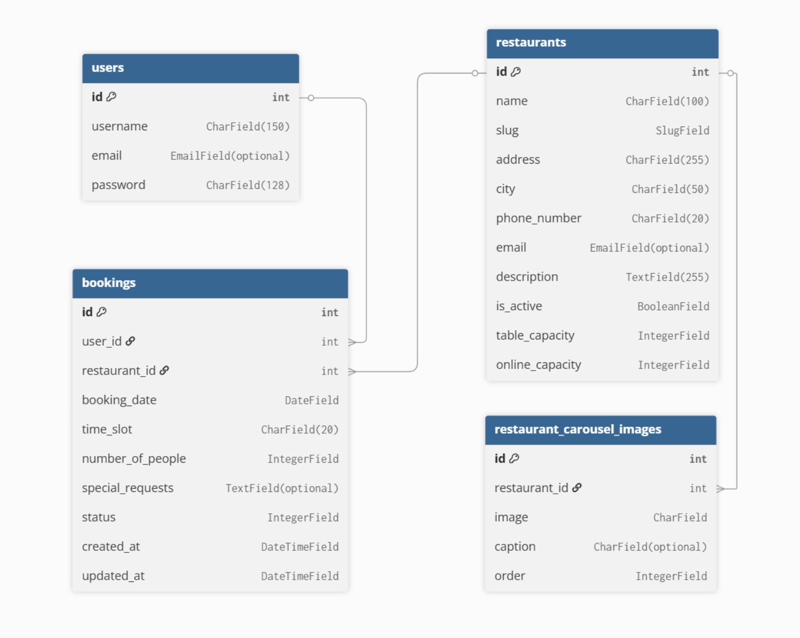

# kode-restaurant

  

**[View the Live Project here](https://kode-restaurant-5f9020dc3f3d.herokuapp.com/)**

# Table of Content
- [User Expeience](#user-experience)
    - [Project Overview](#project-overview)
    - [Project Goals](#project-goals)
    - [User Stories](#user-stories)
    - [Design Choices](#design-choices)
    - [Wireframes](#wireframes)
- [Data Model & Relationships](#data-model--relationships)    
- [Booking flowchart](#booking-flowchart)
- [Technologies Used](#technologies-used)
- [Resources & Tools](#resources--tools)
- [Code](#code)
- [Testing](#testing)
    - [Bugs](#bugs)
    - [Unresolved Bugs](#unresolved-bugs--warnings)
    - [Tesing User Stories](#testing-user-stories)
    - [Manual Testing](#manual-testing)
    - [Automated Testing](#automated-testing)
    - [Accessibility](#accessibility)
- [Deployment](#deployment)
- [Maintenance & Updates](#maintenance--updates)
- [Credits](#credits)

## User Experience

### Project Overview

Kode Restaurant is a fictitious client – a growing restaurant company that currently operates one location and plans to open a second in the near future. The business is performing well and has gained significant popularity, particularly at weekends. However, customers have reported difficulties in booking tables, which has resulted in long queues and frustration.

The restaurant has seating for around 80 guests. To balance reservations with walk-in availability, the management decided that only 50 seats should be available for online booking, while the remaining seats are reserved for customers who arrive without a booking.

### Project Goals

The restaurant aims to improve customer experience and streamline operations by implementing:

1. An online booking system integrated into their website.

2. A customer authentication system, allowing users to register, log in, and log out securely.

3. An administrative interface for staff to manage bookings, monitor availability, and prepare for the restaurant’s expansion.

**Expected Outcomes:**

1. Customers will be able to reserve tables in advance, reducing queues and improving satisfaction.

2. Staff will have better control over seating arrangements and capacity.

3. The restaurant will be prepared to scale its booking system to multiple locations as the business grows.

### User Stories

**Customers User Stories:**

1. Register and Log In: As a customer, I want to register, log in, and log out securely, so that I can manage my bookings.

2. Book a table: As a customer, I want to book a table by selecting a date, time slot, and number of people (max 6), so that I can reserve a place in advance.

3. Booking Confirmation: As a customer, I want to see a booking confirmation, so that I know my reservation is secured.

4. Prevent Duplicate Bookings: As a customer, I should not be able to book more than once in the same time slot, so that the system is fair.

5. View Bookings(Past and Future): As a customer, I want to view my past and future bookings, so that I can keep track of my reservations.

6. Edit a Future Booking: As a customer, I want to edit my booking to change the number of people, so that I can update my plans.

7. Delete a Booking: As a customer, I want to cancel my booking, so that I free up the table if I don’t need it.

**Admin/Staff User Stories:**

1. Admin Login: As an admin, I want to see all bookings for a specific date and time slot, so that I can prepare for service.

2. Manage Bookings: As an admin, I want to create, edit, and delete bookings, so that I can handle phone reservations and customer requests.

3. Manage Restaurant Capacity: As an admin, I want to set the number of seats available for online booking, so that I can balance between online reservations and walk-ins.

4. Add/Manage Restaurants (Future): As an admin, I want to add new restaurant locations, so that the business can expand without changing the system.

**The project's Kanban Board can be viewd [here](https://github.com/users/dagmara-szproch/projects/11)**

### Design Choices

#### Fonts

For the branding of Kode Restaurant, I combined typefaces: **Libertinus Keyboard** is used for "Kode"  and **Audiowide** for the word "Restaurant" . For the main content, **Mulish** is applied to body text due to its clean and readable design , while **Poppins** is used for headings (h1, h2, h3) to create clear hierarchy and emphasis .

#### Colours

The following colours are used consistently across the Kode Restaurant project:

| Purpose | Colour | Hex | Preview |
|---------|--------|-----|---------|
| Navbar & Footer background, form background, font on dark background (landing page) | Light Green | `#eff5e4` | &nbsp; |
| Fonts on light background | Brown | `#5e4b31` | Aa |
| Headings (H1) on dark/transparent landing page background | Gold | `#bb8726` | Aa |
| Button: Confirmed | Green | `#057820e6` | ✔ |
| Button: Cancelled | Orange | `#c16d07` | ✖ |
| Button: Completed | Grey | `#6c757d` | ✔ |

### Wireframes

  

  

  

## Data Model & Relationships

The aplication uses Django's **default `User` model** for authentication (username nad password required, email optional).

On the top of this, three custom models manage the restaurant system:

**1. Restaurant**
- Represents a restaurant with basic details, contact information and capacity limits
- Has a **one-to-many relationship** with:
  - `RestaurantCarouselImage` ( a restaurant can have multiple carousel images)
  - `Booking` (a restaurant can recive many bookings)

**2. RestaurantCarouselImage**
- Each image belongs to a single restaurant (`ForeignKey` to `Restaurant`)
- If the restaurant is deleted, all associated images are also deleted (`on_delete=models.CASCADE`)
- Relationship: **Many-to-one** (Many images per one restaurant)

**3. Booking**
- Links a user (`ForeignKey` to `User`) with a restaurant (`ForeignKey` to `Restaurant`)
- Each booking includes date, time slot, number of people, and optional special requests
- Relationships: **Many-to-one**
  - `User` (one user can make multiple bookings)
  - `Restaurant` (one restaurant can receive multiple bookings)
- The **unique constraint** ensures a user cannot double-book the same restaurant at the same date and time (for confirmed bookings). Cancelled bookings can be replaced.

<h3>Entity Relationship Diagram</h3>

  

## Booking flowchart

<h3>Booking flowchart</h3>

  

## Technologies Used

**1. Languages:**
- Python - the core programming language used to build the application.
- HTML5 - the standard markup language for structuring content on the web.
- CSS3 - used to style the website with custom layouts, colours, and fonts.
- JavaScript - added interactivity and client-side behaviour.

**2. Frameworks & Libraries:**
- Django - the main web framework used to manage models, views, templates, authentication, and admin functionality.
- Bootstrap 5 - responsive frontend framework for layout, forms, and components.
- Django Allauth - user authentication, signup, and login with social account support.
- Django Crispy Forms - improves form rendering and styling in templates.
- Crispy-Bootstrap5 - crispy-forms theme integration with Bootstrap 5.
- Cloudinary - cloud service for storing and optimising images.
- dj3-cloudinary-storage - Django storage backend for Cloudinary.

**3. Database & Deployment:**
- PostgreSQL - relational database used in production.
- psycopg2 - PostgreSQL database adapter for Python/Django.
- Gunicorn - Python WSGI HTTP server for running Django apps in production.
- Whitenoise – serves static files efficiently in Django without extra servers.
- dj-database-url – allows database configuration via environment variables (useful for deployment).
- [Heroku](https://www.heroku.com/) - platform-as-a-service (PaaS) used to deploy, manage, and scale the live application.

**Version Control:**
- Git – version control system to track and manage code changes.
- GitHub – remote repository hosting, project board, and collaboration tool.

**Design & Fonts:**
- [Google Fonts](https://fonts.google.com/) to import fonts.

## Resources & Tools

- [dbdiagram](https://dbdiagram.io/home) to draw Entity-Relationship Diagram.
- [Birme](https://www.birme.net/) to resize, crop, compress and change the image format to WEBP.
- [Contrast Checker](https://webaim.org/resources/contrastchecker/) to check the contrast between colours.
- [Pixabay](https://pixabay.com/) as a source of backround and carousel images.
- [Open AI](https://openai.com/chatgpt/overview/) to create / review the content for spelling, grammar and consistency; to ask for suggestions on how to solve certain problems.
- [CSS Validator](https://jigsaw.w3.org/css-validator/) to validate CSS.
- [HTML Validator](https://validator.w3.org/) to validate HTML.
- [JS Hint Validator](https://jshint.com/) to validate JavaScript.
- Lighthouse Chrome Dev Tools for performance and accessibility testing.

## Code

**Learning resources**
1. **Walkthrough Project:** The code used in my project was based on the “Django Blog” walkthrough project provided by Code Institute. This helped me understand the structure of a Django app, including models, views, templates, and URL routing.
2. **Django Documentation:** I referred to the official Django documentation to extend the project beyond the walkthrough. I explored:
- [Django models/Unique constraint](https://docs.djangoproject.com/en/5.2/ref/models/constraints/#uniqueconstraint) UniqueConstraint lets you enforce rules at the database level to prevent duplicate records. In my app, it ensures that the same user cannot double-book the same restaurant, date, and time slot (unless the previous booking was cancelled).
- [Django widgets](https://docs.djangoproject.com/en/5.1/topics/forms/modelforms/#overriding-the-default-fields) Widgets define how form fields are rendered in HTML. For example, using a date picker is controlled via widgets. They make forms more user-friendly and customisable without altering backend logic.
- [Django aggregate()](https://docs.djangoproject.com/en/5.2/ref/models/expressions/#aggregate-expressions) Used to calculate values like totals, counts, or averages across querysets. Example: I used aggregate(Sum('number_of_people')) to work out how many people had already booked for a given restaurant and time slot.
- [Django clean()](https://docs.djangoproject.com/en/5.2/ref/forms/validation/#using-validation-in-practice) A method for validating model or form data before saving. It allows writing custom rules (e.g., preventing more than 6 guests per user booking).
3. **Flatpickr Calendar:**
- [Flatpickr calendar](https://flatpickr.js.org/examples/) A lightweight JavaScript date/time picker library. I used it to improve the booking form so users can easily select dates and times instead of typing them manually. It provides features like disabling past dates, choosing formats, and enhancing user experience.

## Testing

### Bugs

  **Resolved bugs** found during automated testing:

1. **`booking_date` validation:** Previously, the booking form relied solely on Flatpickr fronted restrictions to prevent selecting today's date, past dates or more than 180 days in advance. users could bypass these rules by disabling JavaScript in their browser, potentially creating invalid bookings. Added server-side validation in `BookingForm` to ensure bookings are only allowed from tomorrow up to 180 days in advance, regardless of fronted controls.
2. **`number_of_people` validation:** Previously, users could bypass the front-end dropdown and submit values greater than 6, which caused inconsistent behaviour and potential booking errors. Now bot the `BookingForm` and `EditBookingForm` strictly enforce the 1-6 range at the backend level.
3. The helper function in booking views **`get_current_bookings`** previously included cancelled bookings (status=2) when counting current reservations, causing checks to be incorect. Updated the helper function to only include bookings with `status=1` (confirmed) when checking current capacity.
4. **`edit_booking`** view now returns an `HttpResponse` for GET request. Previously, accessing the view via GET caused a server error because it returned `None`.
5. **Inconsistent form rendering in authentication pages:** The initial `Sign Up` and `Sign In` templates used `{{ form.as_p }}`, which resulted in inconsistent styling and invalid HTML output. This caused layout issues and validation error in the HTML Validator. Replaced `{{ form.as_p }}` with `crispy-forms` rendering, ensuring consistent Bootstrap styling and clean HTML across all forms.

### Unresolved Bugs / Warnings

**Mixed Content Warnings (HTTPS vs HTTP)**

Some images loaded from Cloudinary were initially requested over HTTP instead of HTTPS. Modern browsers automatically upgrade these requests to HTTPS, so the site functions correctly.

Impact: No visible functional issues for users. All content is served securely.

**Lighthouse Best Practices**

Lighthouse flags “Does not use HTTPS – 3 insecure requests found” due to the same images initially being HTTP. Again, these requests are automatically upgraded by browsers, so there is no risk to users.

Resolution: All images are loaded securely at runtime. No action required for the current deployment.

### Testing User Stories

**Testing Note:** All client-side user stories were verified using automated Django tests to ensure proper functionality, validation, and error handling: [restaurant view tests](restaurant/test_views.py) / [booking forms tests](booking/test_forms.py) / [booking views tests](booking/test_views.py). Admin-related actions, such as creating, editing, and deleting bookings, were tested manually through the Django Admin interface. Screenshots are included where relevant to illustrate the functionality.

| User / Role | User Story                         | Acceptance Criteria                                                                                                                | Testing Method                                                          | Result / Screenshot                                                                                                 |
| ----------- | ---------------------------------- | ---------------------------------------------------------------------------------------------------------------------------------- | ----------------------------------------------------------------------- | ------------------------------------------------------------------------------------------------------------------- |
| Client      | Book a Table Online                | - Select date (next day or later) - Choose time slot - Choose number of guests (max 6) - See booking confirmation         | Django automated tests + manual check of form and confirmation messages |  Passed. Error messages shown when over capacity or double-booked.                      |
| Client      | Edit a Booking                     | - Edit only own future bookings - Cannot exceed restaurant capacity - Changes reflected in summary                           | Django automated tests + manual form check                              |  Passed. Over-capacity edits rejected, valid edits updated correctly.  |
| Client      | Cancel a Booking                   | - Cancel future bookings - Status changes to "Cancelled" - Cannot cancel other users’ bookings - See confirmation message | Django automated tests + manual check                                   |  Passed. Cancelled bookings marked correctly.                      |
| Admin       | Create Booking on Behalf of Client | - Select client, date, time, party size - Respect online capacity                                                               | Manual via Django Admin                                                 |  Passed. Booking created successfully.                                                                             |
| Admin       | Edit / Delete Booking              | - Update date, time, number of people - Delete bookings                                                                         | Manual via Django Admin                                                 |  Passed. Changes reflected immediately; deleted bookings removed.                                                  |

### Manual Testing

**Testing note:** Most of the core functionality (booking flows, validation, capacity limits) is tested via automated Django tests. The following manual tests focus on UI, admin interface, and edge cases that require visual verification.

| ID | Test Description | Expected Result | Actual Result | Pass/Fail |
|----|------------------|-----------------|---------------|-----------|
| 1  | Add a new user via admin |User appears in User list in admin| User appears in admin list | Pass |
| 2  | Add 2 restaurants | Restaurants appear in admin list with correct city, phone, table_capacity, online_capacity | Restaurants appear with correct details | Pass |
| 3 | Attempt to create duplicate booking in admin | System should not allow duplicate | Error message display: "Please correct the error below. Booking with this User, Restaurant, Booking date and Time slot already exists." | Pass |
| 4 | Open homepage (/) | Homepage loads with default restaurant info (name, description, address, etc.) | Default restaurant appears with correct details | Pass |
| 5 | Open restaurants detail via slug: (/kode-restaurant-fictionville) and (/kode-restauarant-snackville) | Pages shows correct restaurant info | Pass |
| 6 | Dropdown menu display all restaurants | Dropdown menu shows Fictionville and Snackville | Dropdown menu shows both restaurant | Pass |
| 7 | Click dropdown link for Fictionville | Navigates to /kode-restaurant-fictionville | Link navigates to correct restaurant | Pass |
| 8 | Click dropdown link for Snackville | Navigates to /kode-restaurant-snackville | Link navigates to correct restaurant | Pass |
| 9 | Check footer info | Shows restaurant name, address, city, phone, email | Footer shows correct info for each restaurant | Pass |
| 10| Register with email - Go to Register page, fill in username, email, password, submit form | New user account is created and they are logged in automatically | Account is created and user is logged in | Pass |
| 11 | Register without email - Go to Register page, fill in username, password, leave the email field blank, submit form | New user account is created and they are logged in automatically | User is registered successfully. Email is optional, so no error appears | Pass |
| 12 | Register with existing username - Go to the Register page, enter a usurneame that already exists in the system,password, submit form | Registration fails and an error massage is displayed | Registration fails and an error message is displayed: "A user with that username already exists." | Pass |
| 13 | Login with Username | User is logged in and redirected to the home page | User is logged in and there is only Logout option in the menu | Pass |
| 14 | Login with wrong credentials - Go to the Login page, enter a wrong username or wrong password, submit the form | User is not logged in, an error message is displayed | User is not logged in and  "The username and/or password you specified are not correct." message is displayed | Pass |

### Automated Testing

1. **Unit and integration tests** were written for core functionality. Their results are documented in the **Testing User Stories**.
2. **HTML Validator** (W3C):

 

3. **CSS Validator** (Jigsaw):

4. **JSHint**:

5. **Lighthouse** (Chrome DevTools):

### Accessibility

- All templates use semantic HTML structure (headings, lists, forms) to support screen readers.

- Interactive elements such as buttons and links include descriptive text rather than icons alone.

- Colour contrast was checked to ensure text is readable against background colours.

- Forms use proper `<label>` tags linked to inputs, improving accessibility for assistive technologies.

- ARIA roles and attributes were added where necessary (e.g. navigation landmarks).

- The site is fully navigable with a keyboard (tab order tested).

## Deployment

The website was deployed to Heroku and can be found **[here](https://kode-restaurant-5f9020dc3f3d.herokuapp.com/)**.

- Heroku is a cloud platform that lets developers create, deploy, monitor and manage apps.
- You will need a Heroku log-in to be able to deploy a website to Heroku.
- Once you have logged into Heroku:
- Click 'New' > 'Create new app'
- Choose a unique name, choose your region and press 'Create app'
- Click on 'Settings' and then 'Reveal Config Vars'
- Add a key of 'DISABLE_COLLECTSTATIC' with a value of '1'.
- Add a key of 'DATABASE_URL' - the value will be the URL you were emailed when creating your database.
- Add a key of 'SECRET_KEY' - the value will be any random secret key (google 'secret key generator' and use it to generate a random string of numbers, letters and characters)
- In your terminal, type the code you will need to install project requirements:
  - pip3 install gunicorn~=20.1
  - pip3 install -r requirements.txt
  - pip3 freeze --local > requirements.txt
- Create an 'env.py' file at the root directory which contains the following:
  - import os
  - os.environ["DATABASE_URL"]='CI database URL'
  - os.environ["SECRET_KEY"]=" Your secret key"
- Create a file at the root directory called Procfile. In this file enter: "web: gunicorn my_project.wsgi" (without the quotes)
- In settings.py, set DEBUG to False.
- YOU SHOULD ALWAYS SET DEBUG TO FALSE BEFORE DEPLOYING FOR SECURITY
- Add ",'.herokuapp.com' " (without the double quotes) to the ALLOWED_HOSTS list in settings.py
- Add, commit and push your code.
- Go back to Heroku, click on the 'Deploy' tab.
- Connect your project to GitHub.
- Scroll to the bottom and click 'Deploy Branch' and your project will be deployed!

## Maintenance & Updates

1. **User model improvements:** Replace the username field with name and surname, make email required so booking confirmations can be sent, and add a phone number field to support SMS notifications.
2. **Menu app:** Create a new dedicated app for managing the restaurant menu, with sections such as lunch menu, dinner menu, and special offers.
3. **Improved UX/UI:** Make the website more colourful and engaging, with better use of visuals and immersive design elements.
4. **Enhanced admin and staff tools:** Extend the admin interface with more intuitive views for managing bookings, menus, and users to improve workflow efficiency.
5. **Reviews and ratings:** Let customers leave feedback about their dining experience.
6. **Performance improvements:** Optimise images and resources further for faster mobile loading.

## Credits

### Media

1. [Pixabay](https://pixabay.com/): Images for carousel:
- [image for carousel 1](https://pixabay.com/photos/soup-dish-food-meal-5726677/) soup
- [image for carousel 2](https://pixabay.com/photos/chicken-asian-cuisine-food-7249270/) chicken
- [image for carousel 3](9https://pixabay.com/photos/pasta-penne-italian-food-7475756/) pasta
- [image for carousel 4](https://pixabay.com/photos/ramen-soup-dinner-noodles-egg-7187812/) ramen
- [image for carousel 5](https://pixabay.com/photos/curry-food-dish-meal-cuisine-7249247/) curry
- [image for carousel 6](https://pixabay.com/photos/tofu-soup-appetizer-food-7249297/) tofu

- [image for background](https://pixabay.com/illustrations/texture-pattern-vintage-watercolor-8637095/) Image for background
